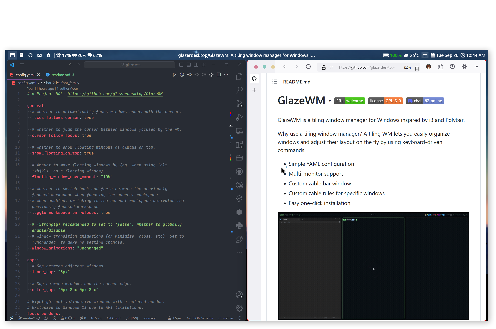

# GlazeWM

This is TosakRin's GlazeWM Config.

## Reference

**Repo**: [GlazeWM](https://github.com/glazerdesktop/GlazeWM)

**Font**: Ubuntu Nerd Font in [Nerd Font](https://www.nerdfonts.com/font-downloads)
